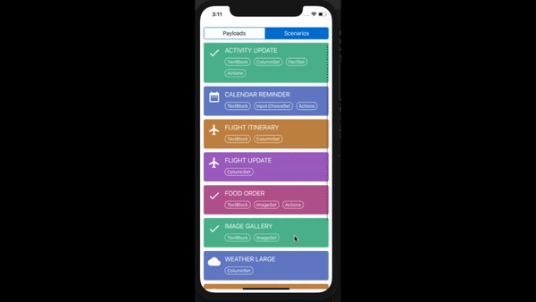

## Usage
**`<AdaptiveCards/>`** under /src is the main component that renders  the card based on the given prop `payload`.

``` html
<AdaptiveCards payload={} 
               hostConfig={}
               onExecuteAction={} 
               onParseError={} />
```

Prop | Type | Description
------------ | ------------- | ------------ |
**payload** | `{object}` | JSON payload adhering to the [schema](https://docs.microsoft.com/en-us/adaptive-cards/authoring-cards/card-schema) 
**hostConfig** | `{object}` | (if any) JSON Host config to override based on [schema](https://docs.microsoft.com/en-us/adaptive-cards/rendering-cards/host-config)
**onExecuteAction** | `{Event Handler}` | (if any) Method to be executed on card actions
**onParseError** | `{Event Handler}` | (if any) Method to be executed on JSON parse errors

## Extensibility
In order to override the rendering of built-in components OR to add support a new custom element type, one can simply make use of the functions exposed through Element Registry.

**Examples**   
* To override built-in `TextBlock` element,   
```
Registry.getManager().registerComponent('TextBlock',CustomTextBlock);
```
* To add support for new element type say `Rating`, add the component in the registry as below :

```
Registry.getManager().registerComponent('Rating',RatingComponent);
```
* To remove the support of an element type (i.e To ignore the rendering of specific element type), 
```
Registry.getManager().removeComponent('Input.Date');
```

## Visualizer
There are lot of sample JSON payloads covering all element types with few real case scenarios which are available within this project.   

To see the visualizer,
* Clone the repo
* Navigate to source/reactnative/ > Run **`npm install`**
* Run > `reactnative run-ios` OR `run-android`


##  About Adaptive Card
* Collection of `elements` and `actions`
* Element is the basic `building block` of card
* Element can be a `standalone` component OR can be a `container` that in turn holds collection of other element types
* Main responsibilities of an element are,
  * **P**arsing
  * **R**endering
* `HostConfig` takes care of applying `default styles`. Custom styles (if any) can also be passed via HostConfig instance
* `Actions` area contains one or more action buttons

## Project Structure
This project is for React-Native implementation of Adaptive cards based on https://github.com/Microsoft/AdaptiveCards.
A Quick overview of the folder structure.
* Components 
* Utils
* Styles

Folder | Description
------------ | -------------
**`src/components`** | This directory contains all the components along with its registry functionalities. This includes standalone components, container types and actions.
**`src/components/actions`** | This directory holds the collection of action elements.
**`src/components/containers`** | This directory holds the container elements that holds collection of elements and its layout.
**`src/components/elements`** | This directory holds all the static individual elements
**`src/components/inputs/`** | This directory holds all the interactable input elements
**`src/utils`** | This directory takes care of keepin the Configuration out of the Code. This will hold anything that is used in multiple places throughout our app in one place.
**`src/styles`** | This directory holds the global styles that will be used and applied across the components and app.The purpose is that we will reuse a lot of the same styling(like Container, Themes,etc....).

 


